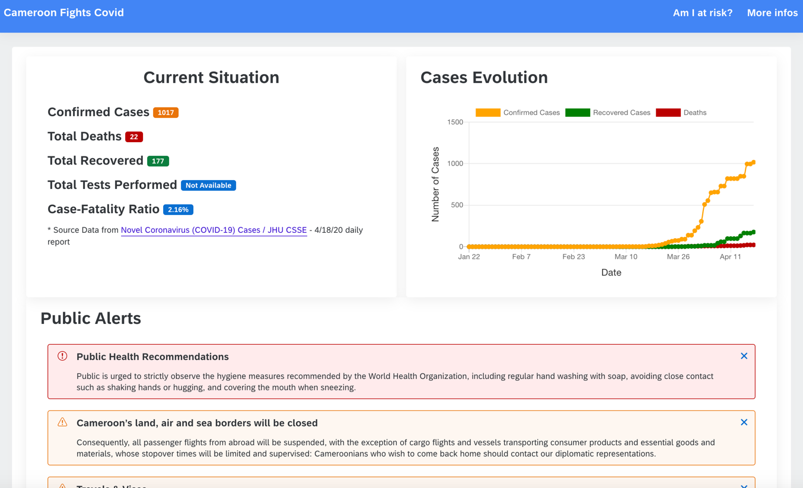

# Description
Code repository for http://cameroon-fights.covid.org - a public information page to help citizens of cameroon figthing covid19

# App Sketching
https://projects.invisionapp.com/freehand/document/qA7X5Dph6

# Demo Screen

# How to run

## Locally
* npm install
* npm run serve

## On k8s
* docker build -t <repo>:<tag> .
* docker push <repo>:<tag>
* kubectl apply -f cfcovid.yml

